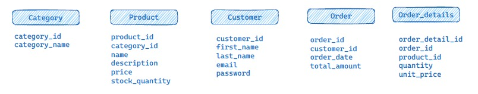

## Database Task

This repository contains tasks and assignment solutions for the database phase of Eng/Ahmed Emad's mentorship.

The Tasks in this repository revolves around an e-commerce DB sample.

## Content

- [Session 3 (2.1) Task](#session-3-21-task)

  - [Summary & Tasks](#summary)
  - [Solution](#solution)
    - [ERD](#erd)
    - [Tables Creation](#table-creation-script)
    - [Dummy Data ](#dummy-data-insertion-script)
    - [Total Revenue Of Specific Day](#total-revenue-of-specific-day)
    - [Monthly Top Selling Products](#monthly-top-selling-products)
    - [Customers With High-Amount Orders](#customers-with-high-amount-orders)

## Session 3 (2.1) Task:

### Summary:

This section will contain db design, creation, intialization, and generating some reports of it.

- Entities:
<p> 

</p>

- Tasks:
  - Create DB schema script for the entities
  - Identify the relationships between entities
  - Draw ERD of this sample schema
  - Write an SQL query to generate a daily report of the total revenue for a specific date.
  - SQL query to generate a monthly report of the top-selling products in a given month.
  - Write a SQL query to retrieve a list of customers who have placed orders totaling more than $500 in the past month.
    Include customer names and their total order amounts. [Complex query].

---

### Solution

#### ERD

<p>
<b>Schema Diagram</b>

</p>
<p>
<b>ER-Diagram</b>

</p>

---

#### Scripts

- Initial Data \
  Scripts for creating tables and filling them with dummy data.
  - ##### [Table Creation Script](Create%20tables.sql)
  - ##### [Dummy Data Insertion Script](Insert%20Data.sql)
- ##### [Total Revenue Of Specific Day](Total%20Revenue-Specific%20Date_Function.sql)

  This script generates a report of total revenue of orders in a specific day

  > The Script creates a function that takes the **specific date** and uses a query to return a **table** having the total revenue and the date.

  > The query sums total price (unit_price \* quantity) of all order items grouped by their order date and then filters the specified date total revenue.

  ```sql
  --Total Revenue for specific date as a function
  CREATE OR REPLACE FUNCTION total_revenue_by_date(report_date date)
  returns table (total_revenue numeric , date date)AS
  $$
  BEGIN
  RETURN QUERY
  --Query
  SELECT
  -- sum of total_prices
  ROUND(SUM(oi.unit_price*oi.quantity)::decimal,2)AS total_revenue,
  -- the orders date (as they are grouped by order_date)
  order_date AS date
  -- from order items table
  FROM order_item AS oi
  -- joing order as it owns the order_date
  LEFT JOIN "order" AS o ON o.order_id = oi.order_fk
  -- filtering only the queried report date
  WHERE o.order_date = report_date
  -- grouping results by date
  GROUP BY o.order_date
  -- sorting higher revenue on the top
  ORDER BY total_revenue DESC;
  END
  $$ LANGUAGE plpgsql;
  ```

  **Result**: \
   You can see the results by using a select query on the funtion and passing the desired date to the function

  ```sql
  -- This generates a total revenue report for the specified date (2024-07-23)
   select * from total_revenue_by_date('2024-07-23');
  ```

  <p></p>

  **Columns:**

  - **total_revenue:** total price of all date's order items
  - **date:** the date of the total revenue

- ##### [Monthly Top Selling Products](Monthly%20Report%20Top%20Selling_Function.sql)

  This script generates a report showing the top-selling products of a specific month of a year.

  > The Script creates a function that takes two parameters month and year and uses a query to return a table of product id , product name , average price , quantity sold , total revenue , order frequency , month of year.

  > The query gets the product basic details , avgerage price of selling this product over the specified month of year , the quantity sold in that month , the total revenue of this product in that month of a year , the order frequency which is orders count where the product appeared , month of a year of this report

  > You can change how top-selling strategy is determined by changing the sorting of the results by ( total_revenue | order_freq | quantity_sold )

  ```sql
  CREATE OR REPLACE FUNCTION monthly_top_selling_prod(mm int , yyyy int)
  RETURNS TABLE (
  prod_id int ,
  prod_name varchar(50),
  avg_price numeric,
  quantity_sold bigint,
  total_revenue numeric,
  order_freq bigint,
  month_year text
  )AS $$
  BEGIN
  Return query
  select p.product_id as prod_id, p.name as prod_name,
  -- the average price of selling the product in a mnth (unit price may differ from product price)
  round(avg(oi.unit_price)::decimal,2)as avg_price,
  -- the sum of product quantity sold in a month
  sum(oi.quantity),
  -- the sum of total price of the product in order items of a month
  round(sum(oi.unit_price*oi.quantity)::decimal,2) as total_revenue,
  -- The count of orders where a product was ordered
  count(oi.product_fk) as order_freq,
  -- the month and year of the orders
  concat(date_part('month',o.order_date),'-',date_part('year',o.order_date)) as month_year
  from order_item oi
  left join "order" as "o" on o.order_id = oi.order_fk
  left join product as "p" on oi.product_fk = p.product_id
  -- filtering the desired month of year total revenue
  where date_part('month',o.order_date)=mm and date_part('year',o.order_date)=yyyy
  -- grouping results by each product and ordering date for the product's order
  group by p.product_id , date_part('month',o.order_date), date_part('year',o.order_date);
  END
  $$ language plpgsql;
  ```

  **Result**: \
   You can see the results by using a select query on the funtion and passing the desired month and year to the function. \
  Add your desired combination of sorting to change the top-selling strategy.

  ```sql
  -- This generates a total revenue report for the specified date (2024-07-23)
    select * from monthly_top_selling_prod(10,2024)
    order by total_revenue desc,order_freq desc, quantity_sold desc
    limit 10;
  ```

     <p>
     
     </p>

  **Columns:**

  - **prod_id, prod_name:** Product basic information.
  - **avg_price**: Average selling price across a month of year.
  - **quantity_sold**: The overall quantity sold across a month of year.
  - **total_revenue:** The total revenue of that product in a month of year.
  - **order_freq:** The ordering count of that product in a month of year or how much orders the product has appeared in.
  - **month_year:** The month of a year for the result.

- ##### [Customers With High-Amount Orders](Filtered_Customers_List.sql)

  This script generates a report listing customers who have placed orders totaling more than $500 in the past month.

  > The query first calculates the total amount of orders placed by each customer in the past month. It then filters and returns customers whose total orders exceed $500, sorted by order amount in descending order.

  ```sql
  -- list of customers with orders totaling more than $500 in the past month
  with monthly_orders as(
  select
  --customer id
  c.customer_id as cust_id
  -- customer name
  , concat(c.first_name,' ',c.last_name) as name
  -- total amount paid by this customer in a month
  , round(sum(o.total_amount)::decimal,2) as orders_amount
  -- the month of the result
  , date_part('month',o.order_date) as order_month
  from customer AS "c"
  right join "order" o on o.customer_fk = c.customer_id
  -- filters only the past month results
  where  date_part('month',o.order_date)  = date_part('month',CURRENT_DATE-INTERVAL '1 MONTH')
  --grouping aggregation by each customer and each month
  group by c.customer_id, date_part('month',o.order_date)
  )
  select cust_id,name,orders_amount from monthly_orders
  -- filtering only cusomers with order_amount >= 500
  where orders_amount >= 500
  -- sorting customers by the order_amount from higher to lower
  order by orders_amount desc;

  ```

  **Result:** \
   You can see the results by running the above query directly. It will display a list of customers along with their total order amounts.

    <p></p>

  **Columns:**

  - **cust_id**: Customer ID.
  - **name**: Full name of the customer.
  - **orders_amount**: Total order amount for the past month.

---
