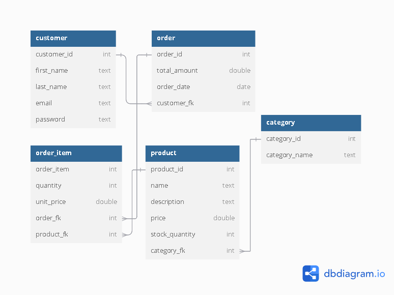
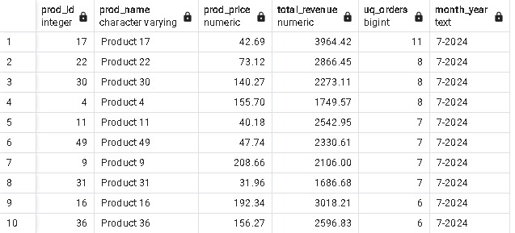

## Database

### Session 3 (2.1) Task:

#### ERD

<b>Schema Diagram</b>

<b>ER-Diagram</b>

- Intial Data
  - [Table Creation Script](Create%20tables.sql)
  - [Dummy Data Insertion Script](Insert%20Data.sql)
- [Total Revenue For Specific Date (Function Script)](Total%20Revenue-Specific%20Date_Function.sql)
    

- [Monthly Repoty Top Selling (Function Script) ](Monthly%20Report%20Top%20Selling_Function.sql)
    

- [Filtered Customers List (Function Script) ](Filtered_Customers_List.sql)
    

