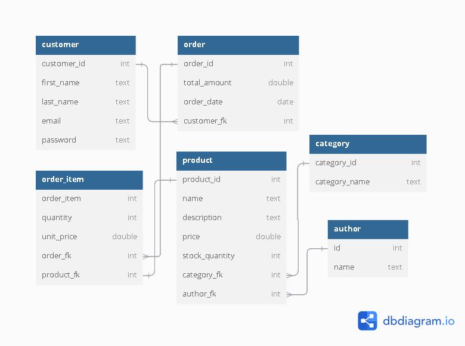
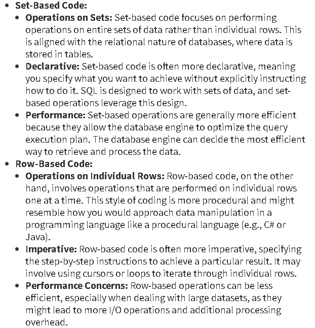

## Optimazation Discussion

### Overview

This document highlights key optimization challenges encountered during the development of the E-Commerce database, focusing on issues faced and the solutions found for improving the performance.

### Content

- [Introduction](#introduction)
- [Updating Columns Based on Large Table Aggregation](#updating-columns-based-on-large-table-aggregation)
- [Selecting Rows Not Referenced in Child Large Table](#selecting-rows-not-referenced-in-child-large-table)

## Introduction

Our e-commerce DB has Order table and Order Item table
order item table has many to one relationship to the order table.

**As shown in following the ERD**:

<p>

</p>

Using the [Insert Dummy Data File](<../Session%203%20(2.1)/SQL/Insert%20Dummy%20Data-2.sql>)
We Inserted Sets of:

- 17 categories
- 5 authors
- 65 products
- 10k customers
- 100K orders
- 1M order items

Performance issues started to appear at this point and will be discussed in the following sections.

### Updating Columns Based on Large Table Aggregation

Table order_item needs a parent order to exist before being inserted.
so orders are created first then the order_items references their PK in the column "order_item.order_fk" .

Also Order table has total_amount column that represents the total amount of all order items belonging to this order.

A need of update query over order table is required after inserting order's relative order_items to calculate "order.total_amount".

- #### Initial Approach (Inefficient)

  The first approach to update total_amount was as follows:

  ```sql
      update "order" AS o
      set total_amount = (
      select sum(quantity*unit_price)
      from order_item
      where order_fk = o.order_id
      )
  ```

  The update statement uses a sub-query to calculate the sum of total_amounts related to the order being updated.

  The problem was that 5 mins passed without the update statement being completed.

  Analyzing the query we can figure the following:

  - the sub-query is executed N times which are the number of orders needed to be updated.

  - In our case the whole order table needs update which means 100k loops repeats the sub-query.

  - The aggregation over 1M order_items is repeated 100K times.

  Assuming that the sub-query takes approx. 250ms (0.25s) this means :

  6.94 hours will be needed to complete this query based on this calculation.

  > - 100k \* 0.25s = 25000s
  > - 25000s /60 = 416.67m
  > - 416.67m /60 = 6.94 Hours

This Approach is called "Row Based Processing" and it is an inefficient approach to deal with large datasets.

- Optimized Query

  A better query was recommended by an AI tool as following:

```sql
-- optimized update query
update "order" o
set total_amount =
-- runs sub query 1 time and joins
sub.total from (
	select order_fk, sum(quantity*unit_price)::decimal as total
	from order_item
	group by order_fk
	) as sub
	-- filters the row that has the order_id which is being selected for update
	where o.order_id = sub.order_fk;
```

**Why is it better?**

- Sub-query is executed only once.
- The aggregation result is joined with the orders that matches the condition
- The update is applied based on the joined sets

This approach is called "Set Based Processing" and is efficient when dealing with large data sets.

<p>

</p>

### Selecting Rows Not Referenced in Child Large Table

As Orders are inserted first and order_items are randomly generated
it is not guaranteed that all orders will have order_items referencing them
and we will need to delete them.

Anyways We will just try selecting those empty orders now.

Several Approaches may satisfy this requirement:

**Notice:** We will assume that orders table has 100K records and Order Item tabke has 1M records.

- Using Not In

```sql
Where not in(ARRAY[])
```

**NOT IN:** works by comparing each value in the array and this can cause performance issues on large datasets

    ``` sql
        select o.order_id,o.total_amount,o.customer_fk
        from "order" as o
        where o.order_id not in (
            select oi.order_fk
            from "order_item" as oi
        )
    ```

In the previous query Not in compares each of the 100K order_ids to all 1M order_fks resulting from the sub-query.

Now its obvious how inefficient this is.

Another approach with NOT IN is to exclude duplicates:

```sql
select o.order_id,o.total_amount,o.customer_fk
from "order" as o
where o.order_id not in (
    select distinct oi.order_fk
    from "order_item" as oi
)
```

The Number of comparisons made are now equal to the number of unique order_fks resulting from the sub-query multiply order_ids in order_table and as the NOT IN behaviour compares each value inside it a better choice is using anti join query.

- Anti-Joins:

  - Using NOT EXISTS

    ```sql
    select * from "order" as o
    where not exists (
    select 1
    from order_item i
    where i.order_fk = o.order_id
    );
    ```

    Unlike NOT IN, NOT Exists stops once it finds a match.

  - Using LEFT JOIN / IS NULL

    ```sql
        select o.order_id,o.total_amount,o.customer_fk
        from "order" as o
        left join order_item as oi
        on oi.order_fk = o.order_id
        where order_item_id is null;
    ```

    **LEFT JOIN /IS NULL:** joins the two tables and leaves records which didn't match the join condition with null values as placeholders for the right table columns then filters those orders with null order_item_id.
